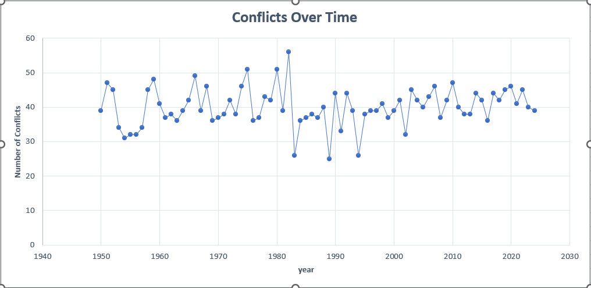
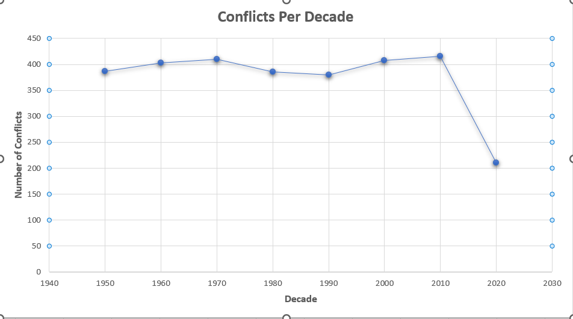
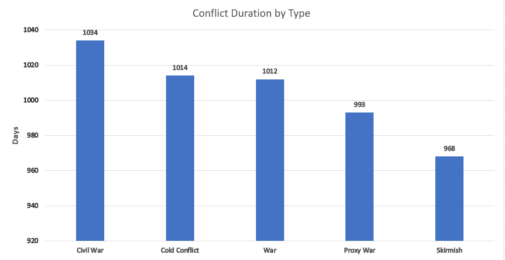
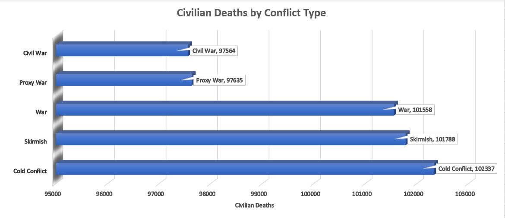

# Global Conflict Analysis (1950–2024) using SQL


## Table of Contents

- [Project Overview](#project-overview)
- [Dataset Description](#dataset-description)
- [Tools Used](#tools-used)
- [Data Validation](#data-validation)
- [Exploratory Analysis](#exploratory-analysis)
- [Economic Impact Analysis](#economic-impact-analysis)
- [Humanitarian Impact](#humanitarian-impact)
- [Environmental Factors](#environmental-factors)
- [Military Activity Analysis](#military-activity-analysis)
- [Key Insights Summary](#key-insights-summary)
- [Limitations](#limitations)
- [Author](#author)

## Project Overview

Global conflicts have shaped political systems, economies, and humanitarian conditions for decades. Understanding the patterns behind conflicts can help researchers and policymakers better evaluate geopolitical risks and humanitarian consequences.

In this project, I conducted an exploratory SQL analysis of a global conflict dataset covering the years **1950–2024**. The goal was to identify patterns in conflict frequency, duration, casualties, economic losses, and environmental conditions associated with conflicts.

Using **MySQL**, I explored how different types of conflicts evolve over time and how various geopolitical, environmental, and military factors may influence their impact.

---

## Quick Project Summary

This project analyzes **3,000 simulated global conflicts (1950–2024)** to uncover patterns in:

- Conflict frequency over time
- Conflict duration and types
- Economic damage
- Civilian casualties
- Refugee displacement
- Environmental and military conditions

The analysis was conducted using **SQL in MySQL Workbench**, with insights documented and visualized for portfolio presentation.

---

## Dataset Description

The dataset contains **3,000 simulated global conflicts** between countries.

Each record includes information about:

- Countries involved in the conflict
- Conflict type
- Conflict duration
- Military and civilian casualties
- Economic losses
- Refugee displacement
- Environmental conditions
- Military activity
- International involvement

### Dataset Details

| Attribute | Value |
|------|------|
Rows | 3000 |
Columns | 30 |
Time Range | 1950–2024 |
File Format | CSV |

---

## Tools Used

- **Excel** – Initial inspection and validation
- **MySQL Workbench** – Data analysis
- **SQL** – Querying and insight extraction
- **GitHub** – Project documentation and portfolio presentation

---

# Data Validation

Before starting the analysis, the dataset was validated to ensure reliability.

Key validation checks included:

- Confirming dataset size
- Checking for missing values
- Verifying column formats
- Detecting negative or suspicious values
- Reviewing category consistency

Example validation query:

```sql
SELECT COUNT(*)
FROM global_conflicts_dataset;
```

Results confirmed:

- Dataset imported successfully
- Total rows: **3000**
- Time range: **1950 – 2024**
- No missing values or duplicate records detected

---

# Exploratory Analysis

## Conflict Trends Over Time

To understand how conflicts evolved over time, I analyzed the number of conflicts per year.

```sql
SELECT 
Year,
COUNT(*) AS total_conflicts
FROM global_conflicts_dataset
GROUP BY Year
ORDER BY Year;
```

### Key Insight

- **1986 recorded the highest number of conflicts (56).**
- Conflict frequency fluctuates significantly over time rather than following a consistent trend.



Image location:
```
Images/conflicts_over_time.png
```

---

## Conflicts Per Decade

To analyze long-term trends, conflicts were grouped by decade.

```sql
SELECT 
FLOOR(Year/10)*10 AS decade,
COUNT(*) AS total_conflicts
FROM global_conflicts_dataset
GROUP BY decade
ORDER BY decade;
```

### Key Insight

- The **2010s experienced the highest number of conflicts**, with **416 recorded conflicts**.



Image location:
```
Images/conflicts_per_decade.png
```

---

# Conflict Characteristics

## Conflict Duration by Type

```sql
SELECT 
Conflict_Type,
AVG(Duration_Days) AS avg_duration
FROM global_conflicts_dataset
GROUP BY Conflict_Type
ORDER BY avg_duration DESC;
```

### Key Insight

- **Civil wars are the longest-lasting conflicts**, averaging **1034 days**.
- Internal conflicts often take longer to resolve due to political fragmentation and prolonged instability.



Image location:
```
Images/confllicts_duration_by_type.png
```

---

## Civilian Casualties by Conflict Type

```sql
SELECT 
Conflict_Type,
AVG(Civilian_Deaths) AS avg_civilian_deaths
FROM global_conflicts_dataset
GROUP BY Conflict_Type
ORDER BY avg_civilian_deaths DESC;
```

### Key Insight

- **Cold conflicts produce the highest civilian casualties on average**, exceeding **102,000 deaths per conflict**.



Image location:
```
Images/civilian_deaths_by_conflict_type.png
```

---

# Economic Impact Analysis

## Economic Loss by Conflict Type

```sql
SELECT 
Conflict_Type,
AVG(Economic_Loss_USD_Billions) AS avg_economic_loss,
SUM(Economic_Loss_USD_Billions) AS total_economic_loss
FROM global_conflicts_dataset
GROUP BY Conflict_Type
ORDER BY avg_economic_loss DESC;
```

### Key Insight

- **Cold conflicts generate the highest average economic loss (~$257B per conflict).**
- **Skirmishes generate the highest total economic damage**, exceeding **$159 trillion**, due to their frequency.

---

## GDP vs Economic Loss

To determine whether wealthier countries suffer greater economic damage during conflicts, the relationship between combined GDP and economic losses was examined.

### Key Insight

The analysis suggests **no strong relationship between national GDP and economic losses during conflicts**, indicating that smaller economies can experience equally severe economic consequences during warfare.

---

# Humanitarian Impact

## Refugee Displacement

```sql
SELECT 
Conflict_Type,
AVG(Refugees_Millions) AS avg_refugees,
SUM(Refugees_Millions) AS total_refugees
FROM global_conflicts_dataset
GROUP BY Conflict_Type
ORDER BY avg_refugees DESC;
```

### Key Insight

- Skirmishes generate the **largest total number of refugees**, exceeding **6.3 billion displaced individuals in the dataset**.

*Note: The extremely large values indicate that the dataset is synthetic.*

---

# International Involvement

## UN Intervention and Ceasefires

```sql
SELECT
UN_Involvement,
Ceasefire,
COUNT(*) AS total_conflicts
FROM global_conflicts_dataset
GROUP BY UN_Involvement, Ceasefire;
```

### Key Insight

UN involvement appears to be **slightly associated with increased ceasefire occurrences**, although the effect is relatively small within this dataset.

---

# Environmental Factors

## Conflict Duration by Terrain

```sql
SELECT 
Terrain_Type,
AVG(Duration_Days) AS avg_duration
FROM global_conflicts_dataset
GROUP BY Terrain_Type
ORDER BY avg_duration DESC;
```

### Key Insight

Conflicts occurring in **urban and forest terrains last the longest**, averaging **~1020 days**.

These environments complicate military operations and often allow conflicts to persist longer.

---

## Climate Zones and Casualties

```sql
SELECT 
Climate_Zone,
AVG(Civilian_Deaths) AS avg_civilian_deaths
FROM global_conflicts_dataset
GROUP BY Climate_Zone
ORDER BY avg_civilian_deaths DESC;
```

### Key Insight

Conflicts occurring in **arid climates show the highest civilian casualty averages**, possibly reflecting resource scarcity and harsh living conditions.

---

# Military Activity Analysis

## Weapons and Casualties

```sql
SELECT 
Weapons_Used,
AVG(Civilian_Deaths) AS avg_civilian_deaths
FROM global_conflicts_dataset
GROUP BY Weapons_Used
ORDER BY avg_civilian_deaths DESC;
```

### Key Insight

Conflicts involving **conventional weapons show the highest casualty averages**, likely due to their widespread availability and usage in many conflicts.

---

# Key Insights Summary

The analysis revealed several important patterns:

- Conflict frequency fluctuates significantly over time.
- The **2010s recorded the highest number of conflicts**.
- **Civil wars last longer than other conflict types**.
- **Cold conflicts produce the highest average economic damage**.
- Conflict terrain and climate conditions appear associated with conflict duration and casualties.
- Conventional weapons are associated with higher casualty rates.

---
⭐ If you found this project interesting, feel free to explore the SQL queries inside the `/sql` folder.
---

---
# Limitations

This dataset is **synthetic and generated for analytical purposes**.

The values do not represent real-world geopolitical statistics but are intended for:

- Data analysis practice
- Machine learning experimentation
- Educational projects

Some metrics (such as refugee counts and air strikes) are exaggerated compared to real-world values.

---

# Author

Ahmed Khaled

Computer Engineering Graduate  
Aspiring Data Analyst
